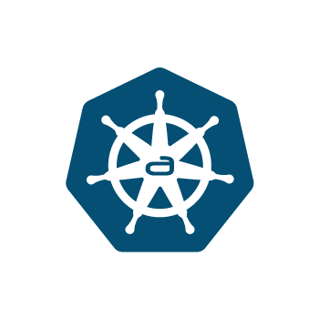

<div align="center">


[![adorsys][page-img]][page]
[![apply][apply-badge]][apply-url]
[![License: Apache-2.0][license-img]][license]

[📖 Documentation][docs]
</div>

# :cloud: Kubernetes as an adorsys Service

This repository bootstraps all adorsys-k8s cluster provisioned by kubermatic.

If you - as an adorsys developer - need help [consult our wiki](https://github.com/adorsys/ops-k8s-bootstrap/wiki).

## Available Tools
The following tools are available for the clusters

* external-dns
* nginx ingress
* certmanager with letsencrypt
* argocd with gitlab & github access
* dex with azure as idp
* external-secrets for accessing the aws-secretstore

## OPS Docu
This section is only relevant for the ops ppl.

### Initial Setup
> **Note**
>
> This is done once(!) and here for documentation purpose only. If we switch
> aws accounts or basic infrastructure, some tasks might be neccessary again.

Terraform should run with YOUR IAM profile configured:
```bash
# in the root folder of this repo
export AWS_PROFILE=new-profile
terraform init
terraform apply
```
Further information is available in #56.

### :grey_question: Add new cluster
After the initial creation of the kubermatic cluster the following steps should
be necessary to bootstrap:

1. Create a new branch
2. Create a new `*-cluster` folder and copy/adjust most of the  `*.tf` from
an existing cluster
3. Review the PR and merge on `main`


[docs]: https://github.com/adorsys/ops-kubernetes-as-an-adorsys-service/wiki
[page]: https://adorsys.com/en/services/devops-services/
[page-img]: https://img.shields.io/badge/www%20-adorsys.com-informational.svg?logo=data:image/png;base64,iVBORw0KGgoAAAANSUhEUgAAACAAAAAgCAYAAABzenr0AAAABmJLR0QA/wD/AP+gvaeTAAAC90lEQVRYhcWXS09TQRTHf70LWxRISYyiJuCrRHxUiSbqUpSNbvUDqN8A/QK6kISwNmpgoS7d+oqCrsCNAQ1GBBMxkoCWmFhaFghJXcwZ7jic3l4q4Ekm0/Oa/5lHZ/43QXypBy4A7cBRYDeQFt8v4CvwDngFPAEKqxg7UlqAPmAeKMVs80AvkPkX4BqgB1hUAKaBy45+BZhR4n4D3UBqteAZYFQGWQTuA4OifwJ2SpwFQmzjog9JzpLob4AdccHbgJwkjgMngQ7RC8A+J9YtwBZeEFsHcAqYEH0KyFYCzzjgL4FaIAGMiO2aF+8XAHBdbCOSWwv0O0U0lgOvIVz2p0BS7OfElmPlXmoFpJxJnBVbEnhOuB1JFOkhXPa0Y38o9ptKjlYAEluSXCtpwjNyw09oQT/t69UKeFvRt4Hgtt224PWEl8xhb2U6xX7HXzKRclsAcFd8nZ69VexFoC7AXK+bgbfABy/YFvS+DEiU2Bx/UmPAMLAFOB9g7naAR8ogB6T3C4sjo94Yrlis9gDzsIA+S3tQpqso4Lv02xSfxcoCzGL2pEkJzIsvrfgg+gykxZdXfE3i+5EAFoBNZQZZb1kI/hPwsgTAnPxuxtzdbrO+BsWXcMbRfA3im1N8zeLLB8CkKAeVAn9Kv7WKyW2XflbxHZL+S4ChUaA/lTnpY7/lSgE5xbf8zwswHA7gkhL4UXr/MokjdpZjiu+i9AMB8BhzFZ9QgOwFdKyKAtq8May0AscF85k19rLxj9E9t6oMhkBuFPgCsNdfsm7WnpA8cGwNhPywS8khhaFLJQx9WktKlgJeiG2QMpQMzN9tSgL7gTqqJ6XDotcBA2L7RgQptZJ1ipjAUGuXlu+PKKAFQzRKknMa+OyAH6kEbqWRcDuWMHs5RHhGtA+TXYR7PCQ5S45ecea+JDHs1c7IbTOYzzGrX8W8/9ppv0XEnseRRgyB1Aop14oYTrjir+ZLolKAI7UY/ngGczPu4e/P80nMYX2N+bApxhn0D4NAb2qf4dU3AAAAAElFTkSuQmCC

[apply-badge]: https://img.shields.io/github/actions/workflow/status/adorsys/ops-kubernetes-as-an-adorsys-service/apply.yml
[apply-url]: https://github.com/adorsys/ops-kubernetes-as-an-adorsys-service/actions/workflows/apply.yml
[license]: https://github.com/adorsys/ops-kubernetes-as-an-adorsys-service/blob/main/LICENSE.md
[license-img]: https://img.shields.io/badge/License-Apache%202.0-blue.svg
